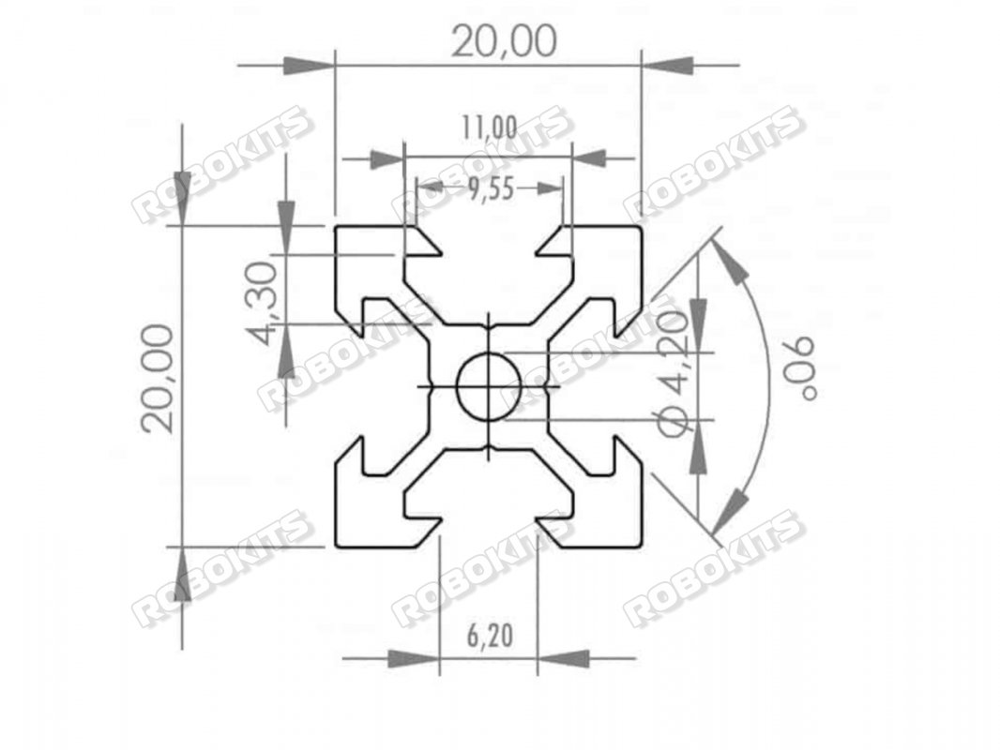

# CNC_Parts
For CNC parts, here are some popular places to buy high-quality components

#TOOLS

| Name | Info  | Dimensions | Image | Price(GST) | Site |  .FCStd | 
| --- |  --- |  --- | --- | --- |  --- | :---: |
| [Aluminium 2020H](https://robokits.co.in/mechanical-parts/aluminium-profile-accessories/astro-industrial-duty-aluminium-2020h-european-standard-anodized-v-slot-profile) | The Astro Industrial Duty Aluminum 2020H European Standard Anodized Profiles made of High Grade tempered Aluminium Alloy 6063 - T5. The dimensions are as per European Standard and the structural cross section thickness is minimum of 1.5 mm. The profile can be used for structural elements in automation machinery, laser cutting machines or 3d printers . Also many protype CNC router machines , XY tables or camera sliders can be made using the same. |     |      | 281|  robokits.co.in   |   not_yet   |
| [Brackets](https://robokits.co.in/robot-parts/aluminium-profile-accessories/standard-3-way-inside-corner-brackets-connector-for-2020-profile) | It's high quality 3-Dimensional aluminum composite frame with 2020 profile with 5mm round holes. It is durable and versatile. | not_yet   |      | 107|  robokits.co.in   |   not_yet   |
| [Handle](https://robokits.co.in/mechanical-parts/aluminium-profile-accessories/aluminium-alloy-metal-90-handle) | Black aluminum alloy pitch metal handle for aluminum profiles of 90mm pitch. | not_yet   |      | 116 |  robokits.co.in   |   not_yet   |

